# Private AI Analyst Stack

Private AI analyst stack for local financial research workflows.

- parse private research documents into clean chunks
- index the corpus for retrieval with ChromaDB
- serve grounded analyst answers through a local app
- fine-tune `unsloth/Qwen3.5-4B` on the cleaned corpus
- export a deployment-ready GGUF and publish a private Hugging Face model

Key links:

- GitHub model mirror: `https://github.com/Kohnnn/model-finetune`
- Hugging Face model: `https://huggingface.co/Mikkkkoooo/qwen35-4b-private-analyst-full-corpus`

## Start Here

- Canonical beginner course: [`docs/fine-tuning-visual-journal.md`](docs/fine-tuning-visual-journal.md)
- Interactive tutorial: [`notebooks/private_analyst_fine_tuning_tutorial.ipynb`](notebooks/private_analyst_fine_tuning_tutorial.ipynb)
- Historical engineering record: [`DEVELOPMENT_JOURNAL.md`](DEVELOPMENT_JOURNAL.md)

## Historical v0.1 Snapshot

This draft-data run is engineering evidence, not a release-quality training recipe.

- parse result: `8179/8180` supported files processed
- cleaned chunks: `23978`
- draft training rows: `23974`
- final train loss: `1.0765`
- historical model folder: `finetune/outputs/qwen35_4b_full_corpus_draft23974`
- historical deployment model: `deployment/models/Qwen3.5-4B.Q4_K_M.gguf`

## Architecture

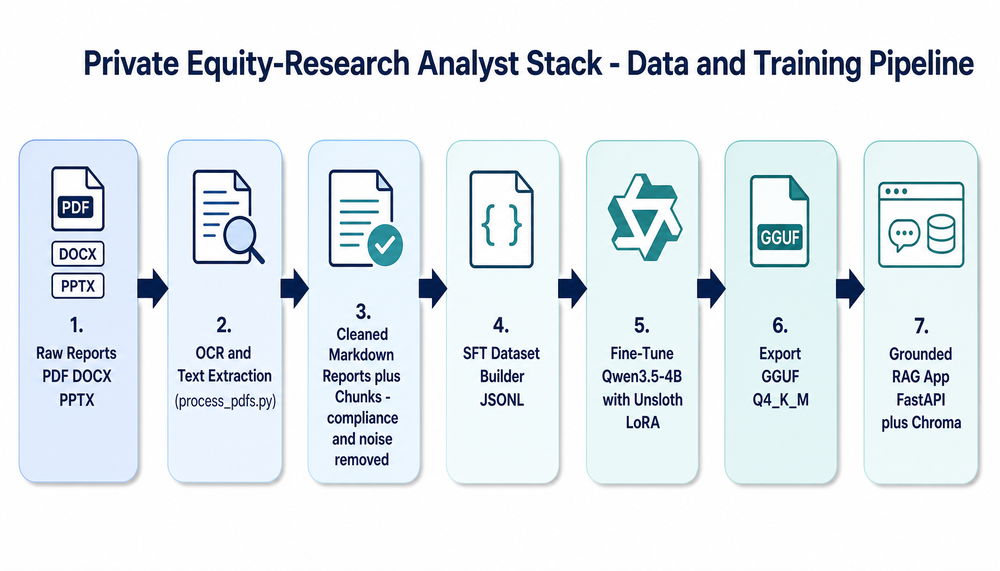

*End-to-end flow: raw reports are parsed and aggressively cleaned, turned into an SFT dataset, used to fine-tune Qwen3.5-4B with Unsloth/LoRA, exported to GGUF, and served behind a grounded RAG app.*

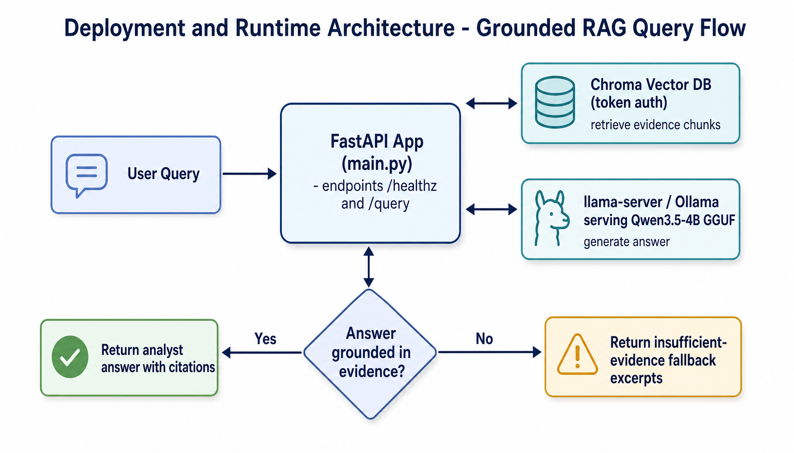

*Runtime: the FastAPI app retrieves evidence from Chroma and asks the local Qwen3.5-4B GGUF to answer. Ungrounded answers are rejected in favor of insufficient-evidence fallbacks.*

<details>
<summary>ASCII architecture (text fallback)</summary>

```text
+------------------+      +---------------------------+      +----------------------+
|   raw_dataset/   | ---> | ocr_pipeline/process_pdfs | ---> | chroma_chunks.jsonl  |
| PDF / DOCX / PPTX|      | extract + clean + chunk   |      | finetune_template    |
+------------------+      +---------------------------+      +----------+-----------+
                                                                       / \
                                                                      /   \
                                                                     v     v
                                                     +------------------+   +---------------------------+
                                                     | deployment ingest|   | prepare_seed_dataset.py   |
                                                     | embed -> Chroma  |   | build draft SFT dataset   |
                                                     +--------+---------+   +-------------+-------------+
                                                              |                           |
                                                              v                           v
                                                     +------------------+      +-------------------------+
                                                     | ChromaDB         |      | qwen35_full_corpus     |
                                                     | research_chunks  |      | _draft.jsonl           |
                                                     +--------+---------+      +------------+------------+
                                                              |                             |
                                                              |                             v
                                                              |                +--------------------------+
                                                              |                | finetune/train.py        |
                                                              |                | Unsloth LoRA on Qwen 3.5 |
                                                              |                +-------------+------------+
                                                              |                              |
                                                              |                   +----------+----------+
                                                              |                   |                     |
                                                              |                   v                     v
                                                              |        +-------------------+   +----------------------+
                                                              |        | merged_model/     |   | gguf/ Q4_K_M export  |
                                                              |        | private HF upload |   | + mmproj companion   |
                                                              |        +-------------------+   +----------+-----------+
                                                              |                                         |
                                                              +------------------------------+          |
                                                                                             |          v
+------------------+      +----------------------+      +------------------+      +--------------> +------------------+
| analyst prompts  | ---> | deployment/app/main | ---> | llama.cpp server | ---> | grounded API   | | deployment/      |
+------------------+      | FastAPI orchestration|      | OpenAI-style     |      | /query         | | models/         |
                          +----------------------+      +------------------+      +----------------+ +------------------+
```

</details>

## Data Flow

```text
raw_dataset/
  -> ocr_pipeline/process_pdfs.py
     -> ocr_pipeline/chroma_chunks.jsonl
        -> deployment/app/ingest.py
           -> ChromaDB collection: research_chunks_v1
     -> ocr_pipeline/finetune_template.jsonl
        -> finetune/prepare_seed_dataset.py
           -> finetune/outputs/datasets/qwen35_full_corpus_draft.jsonl
              -> finetune/train.py
                 -> adapter/
                 -> merged_model/
                 -> training_summary.json
                 -> gguf/
                    -> deployment/models/
                       -> deployment/docker-compose.yml
                          -> live analyst service
```

## How To Run

### 1. Parse documents

```bash
python ocr_pipeline/process_pdfs.py \
  --input-dir raw_dataset \
  --output-dir ocr_pipeline \
  --extensions .pdf .docx .pptx
```

### 2. Run the merged Hugging Face model with `transformers`

```python
from transformers import AutoModelForCausalLM, AutoProcessor

model_id = "Mikkkkoooo/qwen35-4b-private-analyst-full-corpus"
processor = AutoProcessor.from_pretrained(model_id, trust_remote_code=True)
model = AutoModelForCausalLM.from_pretrained(model_id, trust_remote_code=True)

messages = [
    {"role": "user", "content": "Summarize the key margin risks for a consumer lender."}
]

prompt = processor.apply_chat_template(messages, tokenize=False, add_generation_prompt=True)
inputs = processor(text=prompt, return_tensors="pt")
outputs = model.generate(**inputs, max_new_tokens=256)
print(processor.decode(outputs[0], skip_special_tokens=True))
```

### 3. Run the GGUF with `llama.cpp`

```bash
llama-cli \
  -m finetune/outputs/qwen35_4b_full_corpus_draft23974/gguf/qwen3_5_4b_private_analyst_full_corpus_q4_k_m_gguf/Qwen3.5-4B.Q4_K_M.gguf \
  --mmproj finetune/outputs/qwen35_4b_full_corpus_draft23974/gguf/qwen3_5_4b_private_analyst_full_corpus_q4_k_m_gguf/Qwen3.5-4B.BF16-mmproj.gguf \
  -cnv \
  -p "Summarize the key margin risks for a consumer lender."
```

### 4. Run in Ollama

This path is for local experimentation. Keep the model private.

1. Put these two files in the same folder:
   - `Qwen3.5-4B.Q4_K_M.gguf`
   - `Qwen3.5-4B.BF16-mmproj.gguf`
2. Create a `Modelfile`:

```text
FROM ./Qwen3.5-4B.Q4_K_M.gguf
TEMPLATE "{{ .Prompt }}"
PARAMETER num_ctx 4096
SYSTEM You are a private financial research analyst. Answer concisely and stay grounded in provided evidence.
```

3. Build and run:

```bash
ollama create private-analyst-qwen35 -f Modelfile
ollama run private-analyst-qwen35 "Summarize the key margin risks for a consumer lender."
```

If your Ollama build does not handle the Qwen 3.5 companion projection file cleanly, use the `llama.cpp` path above instead. The `llama.cpp` path is the validated one in this repo.

### 5. Run the full private analyst service

Prepare `deployment/.env` from `deployment/.env.example`, then run:

```bash
python deployment/bootstrap_local.py
```

Query it:

```bash
curl -X POST http://localhost:8000/query \
  -H "Content-Type: application/json" \
  -d '{"query": "What are the key margin risks for ACB?"}'
```

### 6. Run a small live benchmark against `/query`

```bash
python deployment/evaluate_live_query.py --output-path deployment/benchmarks/latest_report.md
```

## Fine-Tuning Workflow

The release path accepts only audited, human-reviewed rows with `metadata.review_status=approved`, source hashes/spans, and `metadata.document_family_id`. It splits exact copies and grouped revisions by document family, verifies full targets fit without truncation, uses bf16 LoRA with assistant-only loss, and records baseline/final evaluation, manifests, hashes, and enforced release gates.

```powershell
./finetune/setup_gpu_env.ps1
.venv\Scripts\python.exe finetune/train.py --dry-run --dataset-path finetune/outputs/datasets/qwen35_approved_sft.jsonl
```

Continue with the exact smoke, training, evaluation, export, validation, publication, and deployment commands in [`docs/fine-tuning-visual-journal.md`](docs/fine-tuning-visual-journal.md).

## Release Checklist

- rerun parse and review `ocr_pipeline/parse_failures.log`
- regenerate the SFT dataset
- human-review rows, complete provenance/reviewer fields, and mark only accepted examples `approved`
- run `finetune/audit_dataset.py` and require zero errors
- validate the document-family split, assistant-only loss, baseline, and final metrics in `run_manifest.json`
- run the private frozen-context, retrieval, and live claim-ledger comparison
- export merged HF, GGUF, matching mmproj, and SHA-256 artifacts
- run `deployment/evaluate_live_query.py` as the fixed five-case release smoke
- pass `finetune/validate_release.py`
- copy both GGUF files and `SHA256SUMS` into `deployment/models/`
- run `python deployment/bootstrap_local.py --ingest-limit 1024`
- verify `/healthz`, `/query`, and answer modes
- upload only through the private, release-manifest-gated Hub helper

## Roadmap

### Model selection

The target task is **VietCap-style equity-research prose**: grounded, analytical
Vietnamese/English commentary. There is **no tool-calling or agentic requirement**,
so raw reasoning/agent benchmarks matter less than instruction-following, bilingual
fluency, long-context grounding, and clean local fine-tuning on a 16 GB GPU.

| Decision | Model | Rationale |
| --- | --- | --- |
| **Champion (selected)** | `unsloth/Qwen3.5-4B` | Strong VI/EN fluency, proven Unsloth + LoRA + GGUF path already wired end-to-end, fits 16 GB. Pipeline and deployment are built around it. |
| Considered | Qwen3.5-9B | Better quality but heavier to train/serve locally; revisit only if 4B quality gates fail. |
| Considered | SmolLM3-3B | Fully open and light, but weaker Vietnamese coverage for finance prose. |
| **Rejected** | Gemma 4 (E2B/E4B/31B/MoE) | Evaluated as a challenger; dropped. Unsloth tokenizer friction, multimodal/agentic strengths irrelevant to text-only analyst output, and no clear quality win over Qwen3.5-4B for this corpus. |

Gemma 4 experimentation (probe scripts and the direct-transformers trainer) has been
removed from the repo. The decision and the prior evaluation notes are documented in
[`docs/model-roadmap.md`](docs/model-roadmap.md) and
[`docs/model-selection-decision.md`](docs/model-selection-decision.md).

### Model quality

- replace draft-generated completions with a curated human-reviewed SFT set
- add a held-out evaluation pack of analyst questions and golden answers
- compare full-corpus training against a smaller higher-quality reviewed subset
- retry response-only masking once the Windows Qwen 3.5 path is more stable

### Retrieval quality

- tune chunking and overlap per document type
- add metadata-aware retrieval filters by company, sector, and year
- benchmark embedding choices against your actual analyst questions

### Deployment

- benchmark the new Qwen 3.5 GGUF in the live RAG app
- reduce fallback-only answers through better serving prompts and evaluation loops
- add a production profile for HTTPS and remote access

### Ops and publishing

- tag future model versions consistently across GitHub, GGUF, and Hugging Face
- automate smoke tests for parse, ingest, query, train, and export flows
- keep all private corpora and generated datasets out of public distribution

## Learning Resources

All visual guides by [Maarten Grootendorst](https://substack.com/@maartengrootendorst) - excellent LLM education with 50+ custom visuals per post.

### Recommended Reading Order (by relevance to this project)

| # | Topic | Why Relevant | Images |
|---|-------|--------------|--------|
| 1 | [Quantization](docs/quantization.md) | Deploying GGUF models efficiently | 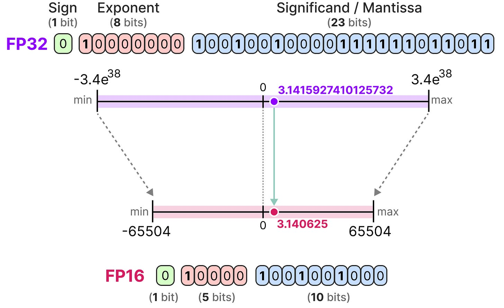 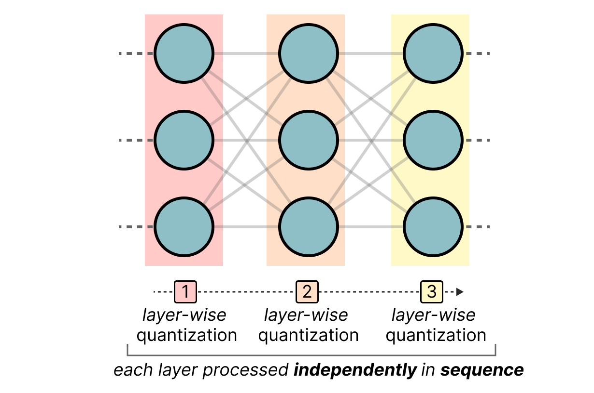 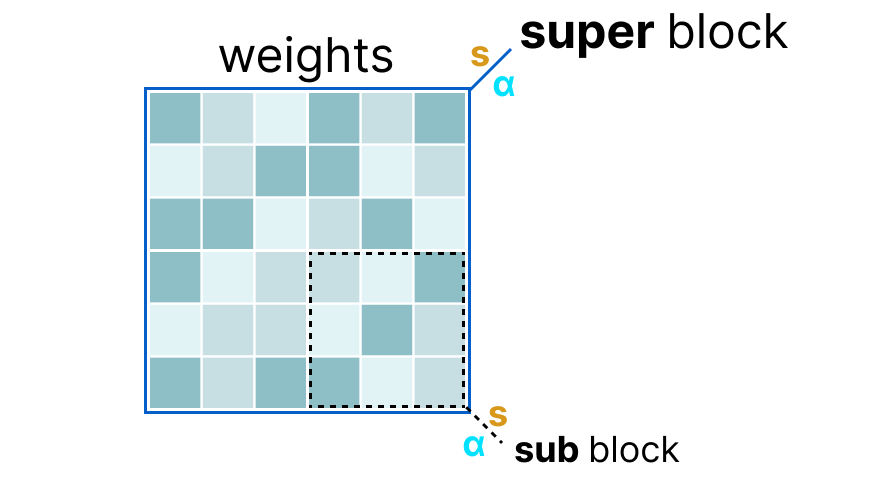 |
| 2 | [Mixture of Experts](docs/moe.md) | Gemma 4 26B A4B uses MoE architecture | 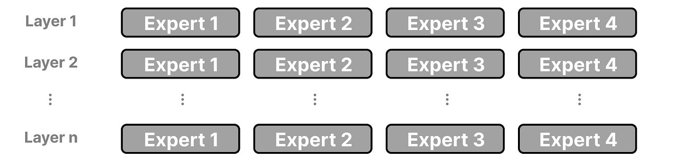 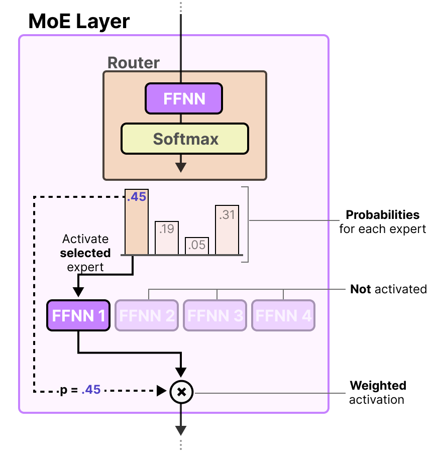  |
| 3 | [Gemma 4](assets/gemma4/) | Background reading on a modern model family (evaluated then dropped as a challenger — see Model selection) | 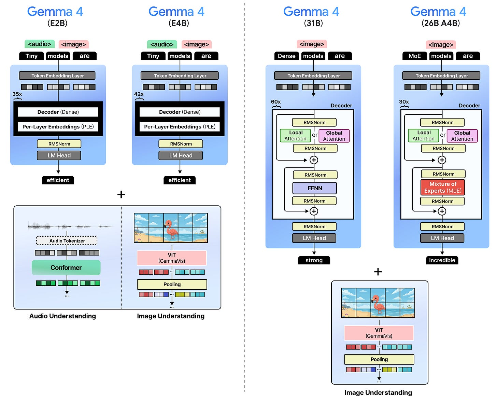 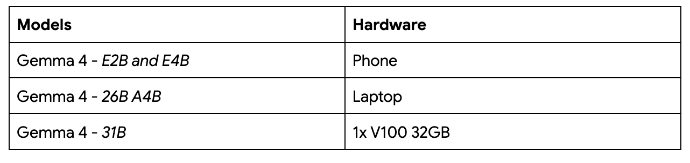 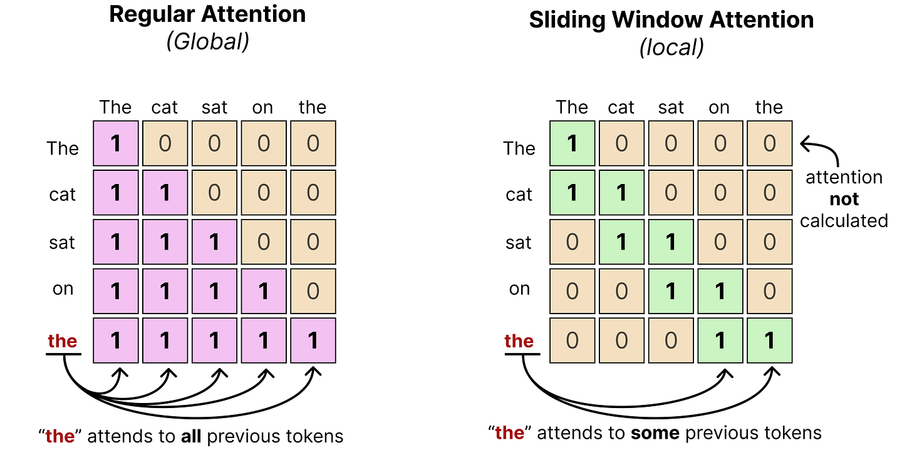 |
| 4 | [Reasoning LLMs](docs/reasoning-llms.md) | Test-time compute, chain-of-thought | 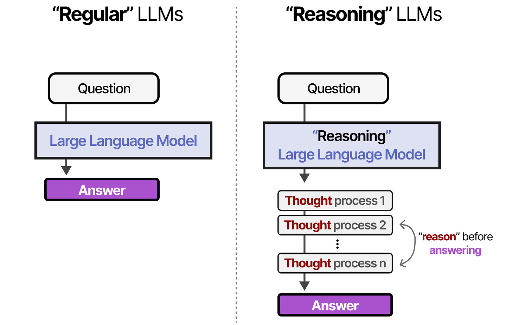 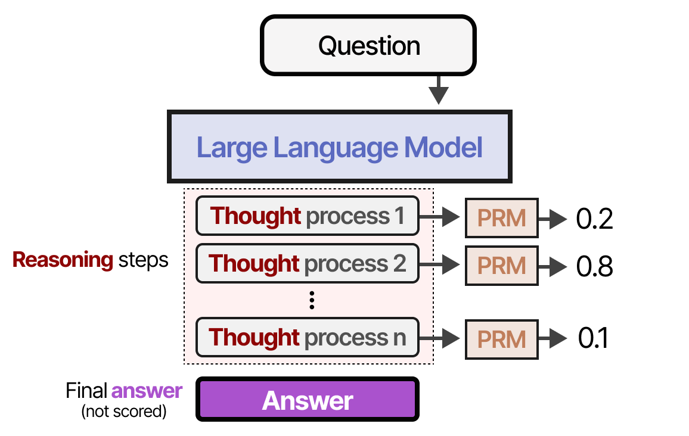  |
| 5 | [LLM Agents](docs/llm-agents.md) | Planning, memory, tools for agents | 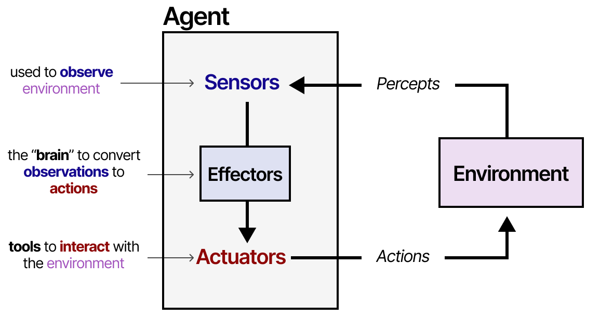 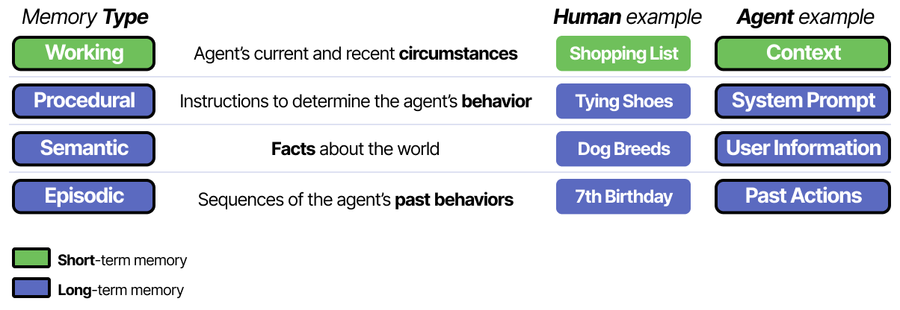 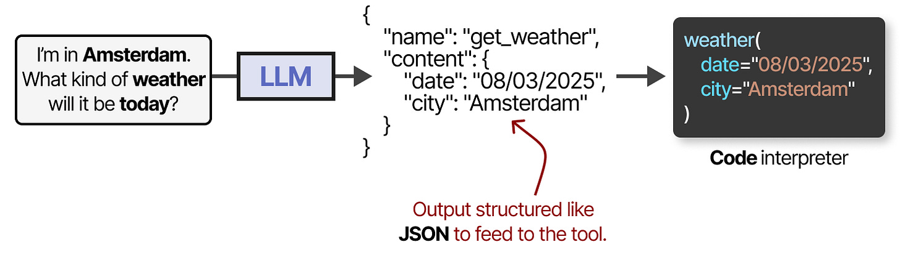 |
| 6 | [Mamba](docs/mamba.md) | Alternative to Transformers | 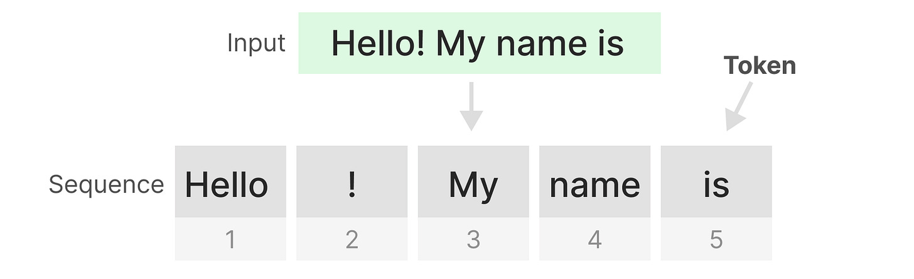  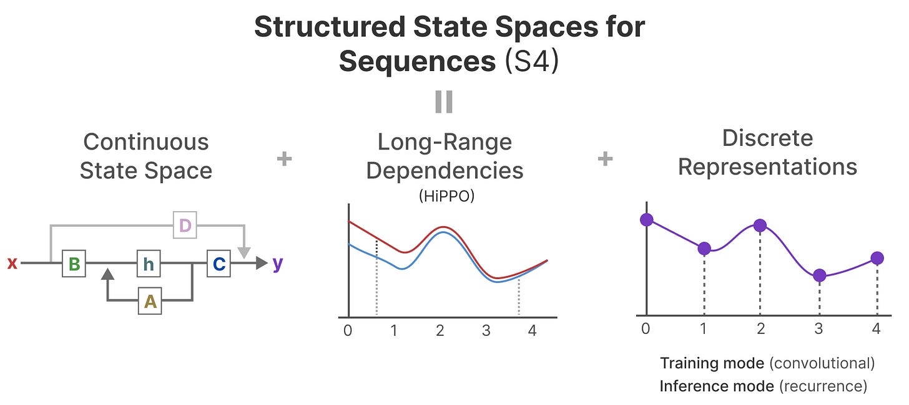 |

### Quick Descriptions

**[Quantization](docs/quantization.md)** - Compress models from FP32 to INT8/INT4. Covers GPTQ, GGUF (used in this repo), symmetric/asymmetric quantization, calibration, and QAT.

**[Mixture of Experts](docs/moe.md)** - Expert routing, load balancing, sparse vs dense parameters. Gemma 4 26B A4B uses 128 experts with 8 activated.

**[Gemma 4](assets/gemma4/)** - Interleaving layers, K=V optimization, p-RoPE, vision encoder, per-layer embeddings, audio encoder (E2B/E4B). 40 images total.

**[Reasoning LLMs](docs/reasoning-llms.md)** - Test-time compute scaling, Chain-of-Thought, DeepSeek-R1 training pipeline, PRM vs ORM.

**[LLM Agents](docs/llm-agents.md)** - Memory (short/long term), Tools (function calling, MCP), Planning (ReAct, Reflexion), Multi-agent systems.

**[Mamba](docs/mamba.md)** - State space models, selective scan, HiPPO matrix, linear-time inference vs Transformer quadratic.

### Original Blog Posts

- [A Visual Guide to Quantization](https://newsletter.maartengrootendorst.com/p/a-visual-guide-to-quantization)
- [A Visual Guide to Mixture of Experts](https://newsletter.maartengrootendorst.com/p/a-visual-guide-to-mixture-of-experts)
- [A Visual Guide to Gemma 4](https://newsletter.maartengrootendorst.com/p/a-visual-guide-to-gemma-4)
- [A Visual Guide to Reasoning LLMs](https://newsletter.maartengrootendorst.com/p/a-visual-guide-to-reasoning-llms)
- [A Visual Guide to LLM Agents](https://newsletter.maartengrootendorst.com/p/a-visual-guide-to-llm-agents)
- [A Visual Guide to Mamba and State Space Models](https://newsletter.maartengrootendorst.com/p/a-visual-guide-to-mamba-and-state)

## Docs

- `DEVELOPMENT_JOURNAL.md` - chronological engineering journal
- `RELEASE_NOTES.md` - milestone summary
- `deployment/README.md` - deployment and bootstrap workflow
- `deployment/app/README.md` - app internals
- `ocr_pipeline/README.md` - parser details and output schema
- `finetune/README.md` - training workflow and artifact layout
- `finetune/QWEN35_TRAINING_NOTES.md` - detailed Qwen 3.5 troubleshooting log
- `docs/fine-tuning-visual-journal.md` - canonical beginner fine-tuning and release course
- `notebooks/private_analyst_fine_tuning_tutorial.ipynb` - safe interactive tutorial
- `FINE_TUNING_GUIDE.md` - legacy pointer to the canonical course

## Privacy Notes

- `raw_dataset/` is private and gitignored
- generated JSONL datasets are gitignored
- local model binaries are gitignored
- `deployment/.env` is local-only
- the Hugging Face model repo is private because the source corpus is private
