# Private Analyst Fine-Tuning: A Visual Beginner Journal

This is the canonical learning path for this repository. It explains what each stage does, why it exists, what can go wrong, and which evidence is required before a private model can be released.

The historical run remains in [`DEVELOPMENT_JOURNAL.md`](../DEVELOPMENT_JOURNAL.md). Its draft-data result is useful engineering evidence, but it is not the release standard described here.

## What you will learn

By the end, you can:

1. explain the difference between retrieval-augmented generation (RAG) and fine-tuning;
2. turn private documents into traceable JSONL examples;
3. review examples instead of training on synthetic drafts blindly;
4. keep documents out of both training and evaluation at the same time;
5. train Qwen3.5-4B with bf16 LoRA and assistant-only loss;
6. compare the base model with the trained candidate;
7. export and hash a GGUF bundle;
8. publish only a gate-approved private Hugging Face release;
9. verify the exact artifact used by the local grounded RAG app.

## Safety rules

- Never commit `raw_dataset/`, generated JSONL, model weights, `.env`, tokens, Chroma data, or benchmark answers containing private excerpts.
- A row marked `draft` is not training data. A human must inspect and mark it `approved`.
- Fine-tuning teaches behavior and style. RAG supplies current facts and evidence.
- Training loss alone never proves model quality.
- A safe evidence fallback is good application behavior, but it does not count as a successful model answer.
- Upload only after `validate_release.py` passes. The upload helper always creates private repositories.

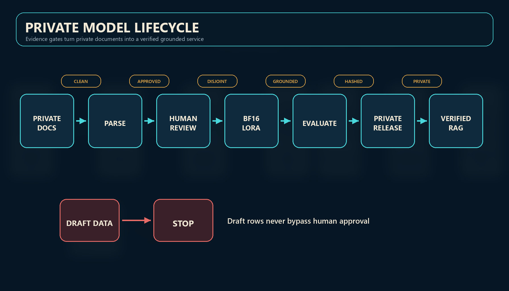

*The lifecycle has evidence gates between stages. Files do not become a release merely because training completed.*

## 1. The mental model: RAG and fine-tuning solve different problems

RAG retrieves passages when a question arrives. Fine-tuning changes how the model responds. This stack uses both:

- **RAG:** Chroma retrieves source chunks with company, report, year, and chunk metadata.
- **Fine-tuning:** reviewed examples teach concise bilingual equity-research structure.
- **Grounding guard:** the app rejects answers without source citations.

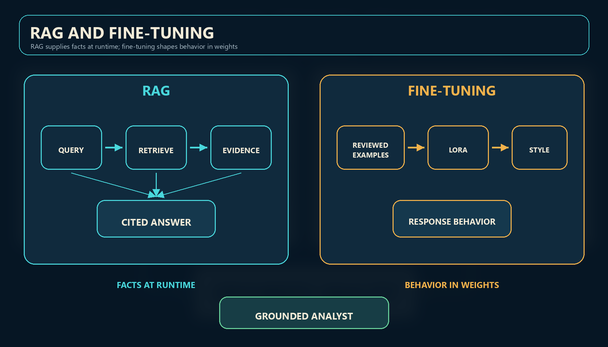

Use RAG when facts change, must be cited, or must remain outside model weights. Use fine-tuning when the desired improvement is tone, structure, instruction following, or a repeatable analytical pattern.

## 2. Terminal, repository, environment, and command

A **terminal** is a text interface for running programs. The **repository root** is `D:\finetune`; commands in this guide start there. A Python **virtual environment** isolates this project's packages from other Python projects.

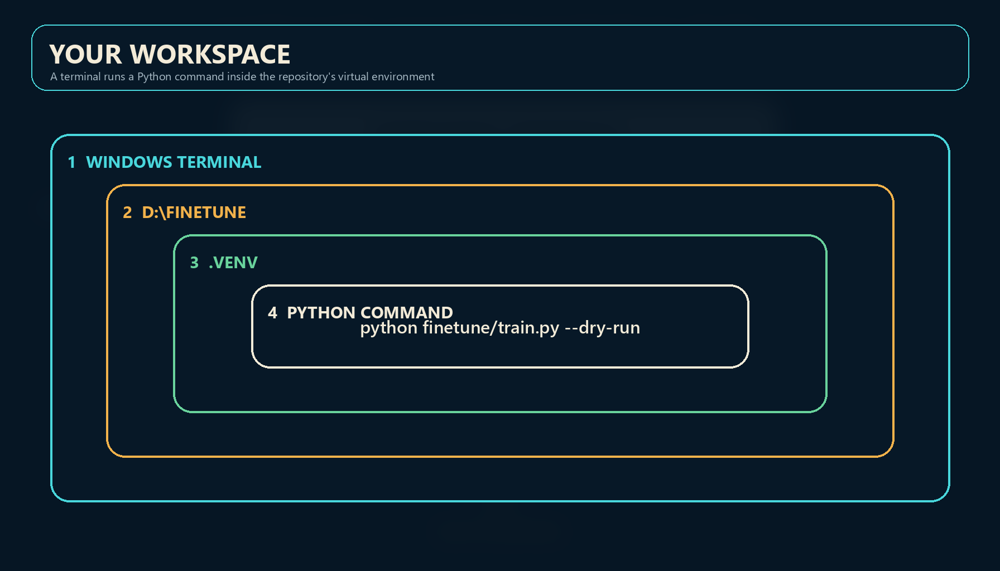

Create the validated Windows GPU environment:

```powershell
./finetune/setup_gpu_env.ps1
```

Confirm Python and CUDA:

```powershell
.venv\Scripts\python.exe --version
.venv\Scripts\python.exe -c "import torch; print(torch.cuda.is_available(), torch.cuda.get_device_name(0), torch.cuda.is_bf16_supported())"
```

Stop if CUDA or bf16 support is false. The production path intentionally does not fall back to a less reliable precision.

## 3. Parse documents into two outputs

The parser reads PDF, DOCX, and PPTX files, removes known boilerplate, chunks useful text, and writes:

- `ocr_pipeline/chroma_chunks.jsonl` for retrieval;
- `ocr_pipeline/finetune_template.jsonl` for supervised examples with empty assistant responses.

```powershell
.venv\Scripts\python.exe ocr_pipeline/process_pdfs.py `
  --input-dir raw_dataset `
  --output-dir ocr_pipeline `
  --extensions .pdf .docx .pptx
```

Each row carries `metadata.doc_id`. That stable document identifier is later used to prevent evaluation leakage.

## 4. Understand one JSONL example

**JSONL** means one JSON object per line. It is streamable and easy to validate. A training row contains a conversation plus source metadata:

```json
{
  "messages": [
    {"role": "system", "content": "You are a grounded financial analyst."},
    {"role": "user", "content": "Context:\n...\n\nTask: Analyze the margin risk."},
    {"role": "assistant", "content": "The reviewed ideal response."}
  ],
  "metadata": {
    "doc_id": "stable_source_document_id",
    "chunk_index": 3,
    "review_status": "approved"
  }
}
```

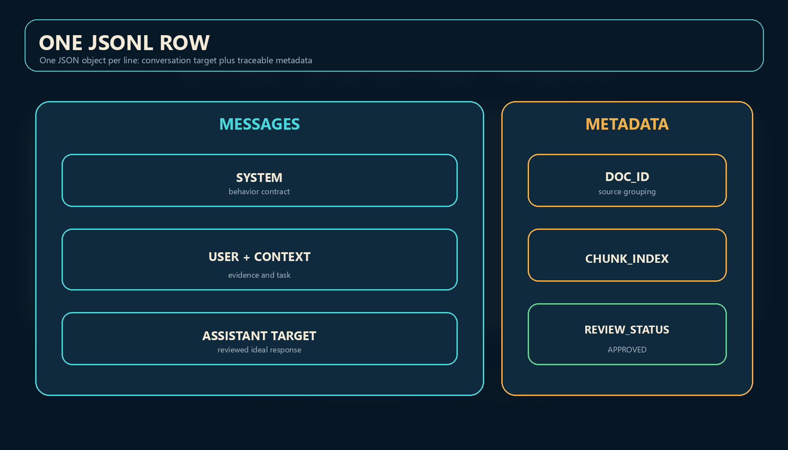

The user context is evidence, the assistant content is the behavior target, and metadata controls traceability and release safety.

## 5. Generate drafts, then perform human review

The seed generator extracts candidate analytical text. It deliberately marks every row as `draft`:

```powershell
.venv\Scripts\python.exe finetune/prepare_seed_dataset.py `
  --input-path ocr_pipeline/finetune_template.jsonl `
  --output-path finetune/outputs/datasets/qwen35_review_queue.jsonl `
  --max-rows 512 `
  --max-context-words 450
```

For every row selected for training:

1. open the source context and assistant completion;
2. correct unsupported claims, copied boilerplate, broken numbers, and poor prose;
3. reject weak or ambiguous examples;
4. set `metadata.review_status` to `approved` only after inspection;
5. save approved rows to a separate private JSONL file.

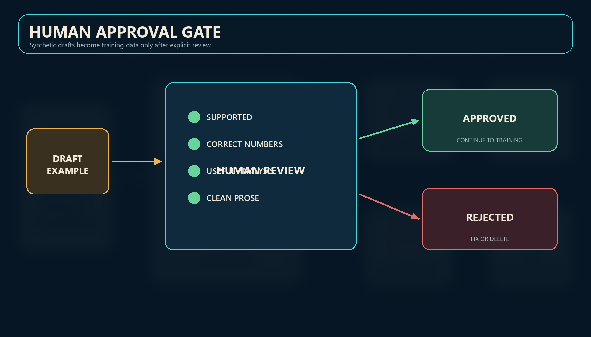

The training script drops everything except `approved`. It also blocks rows without `metadata.doc_id`.

Validate without loading a model:

```powershell
.venv\Scripts\python.exe finetune/train.py `
  --dry-run `
  --dataset-path finetune/outputs/datasets/qwen35_approved_sft.jsonl
```

For parser-only validation of the empty template, use the explicit non-training exception:

```powershell
.venv\Scripts\python.exe finetune/train.py --dry-run --allow-empty-assistant --max-samples 10
```

## 6. Split by source document, not row

Overlapping chunks from one report are similar. A row-level split can put one chunk in training and its neighbor in evaluation, making the score look better than reality.

The pipeline chooses evaluation **document IDs** deterministically, then puts all chunks from each chosen report into evaluation.

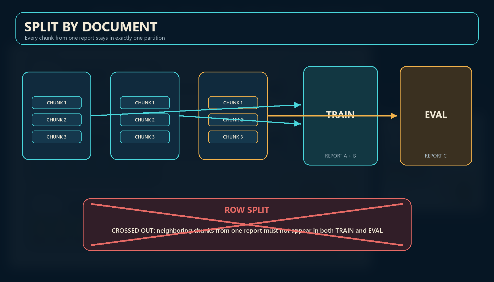

The run manifest records both document lists. The release gate fails if they overlap.

## 7. Chat templates and assistant-only loss

A chat template turns the message objects into model tokens. During supervised fine-tuning, only assistant tokens should contribute to the loss. Otherwise the model spends capacity learning to reproduce system instructions, user questions, and private context.

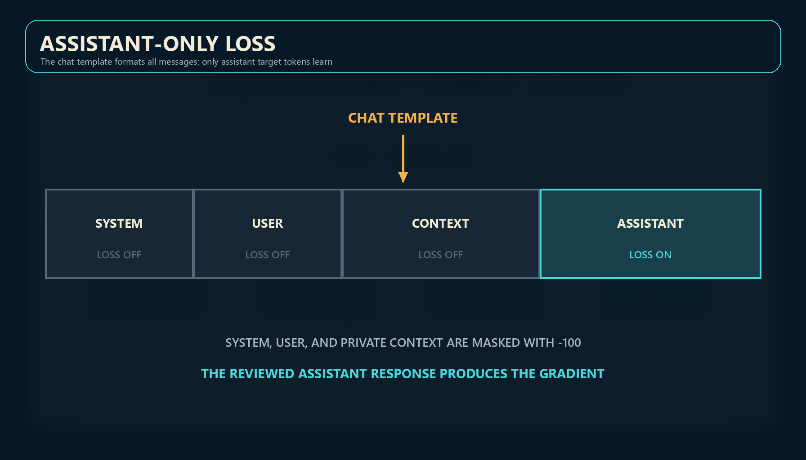

`train.py` requires Unsloth response-only masking. It stops instead of silently switching to full-sequence training.

## 8. Why bf16 LoRA fits this machine

The four-billion-parameter base model stays mostly frozen. LoRA adds small trainable matrices to attention and feed-forward projections. Current Unsloth guidance estimates about 10 GB VRAM for Qwen3.5-4B bf16 LoRA, which fits the target RTX 4060 Ti 16 GB.

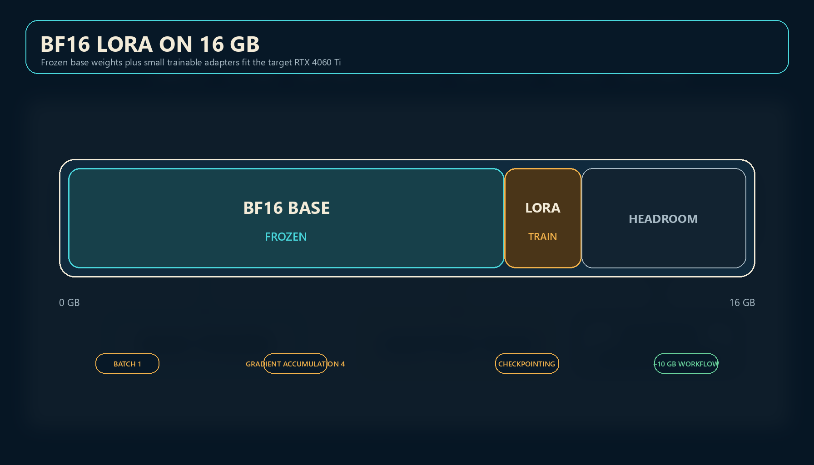

The production defaults are deliberately boring:

- bf16 base loading with `load_in_16bit=True`;
- batch size `1`;
- gradient accumulation `4`;
- LoRA rank `16`, alpha `16`;
- Unsloth gradient checkpointing;
- maximum sequence length `1024`;
- seed `3407`.

## 9. Run a small smoke training job

First use a small approved sample and skip expensive exports:

```powershell
.venv\Scripts\python.exe finetune/train.py `
  --dataset-path finetune/outputs/datasets/qwen35_approved_sft.jsonl `
  --output-dir finetune/outputs/qwen35_4b_approved_smoke `
  --max-samples 64 `
  --num-epochs 0.1 `
  --skip-gguf-export
```

A successful smoke run proves that loading, formatting, masking, document splitting, evaluation, checkpoints, and adapter saving work. It does not prove quality.

## 10. Train and resume safely

Commit the intended training code and confirm `git status --short` is empty. Production training refuses a dirty worktree. Then run the approved dataset:

```powershell
.venv\Scripts\python.exe finetune/train.py `
  --dataset-path finetune/outputs/datasets/qwen35_approved_sft.jsonl `
  --output-dir finetune/outputs/qwen35_4b_approved_v1 `
  --max-seq-length 1024 `
  --batch-size 1 `
  --gradient-accumulation 4 `
  --num-epochs 1 `
  --eval-split 0.1 `
  --save-steps 200 `
  --save-merged-model `
  --skip-gguf-export
```

If interrupted, rerun the same command with:

```powershell
--resume-from-checkpoint True
```

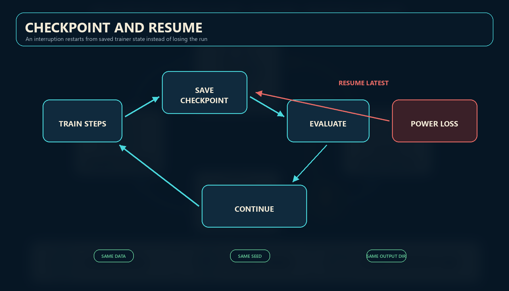

The immutable record is `run_manifest.json`. It contains the base model commit, dataset hash, code commit, package versions, seed, split, precision, assistant-only setting, baseline loss, final loss, and training metrics.

## 11. Compare the base model and trained candidate

Use the same retrieval corpus and five-question benchmark for both models. First save a baseline:

```powershell
.venv\Scripts\python.exe deployment/evaluate_live_query.py `
  --label baseline `
  --json-output-path deployment/benchmarks/baseline.json `
  --output-path deployment/benchmarks/baseline.md
```

After serving the candidate:

```powershell
.venv\Scripts\python.exe deployment/evaluate_live_query.py `
  --label candidate `
  --baseline-json deployment/benchmarks/baseline.json `
  --json-output-path deployment/benchmarks/candidate.json `
  --output-path deployment/benchmarks/candidate.md
```

A grounded model answer must use `answer_mode=model`, cite only labels actually returned in `sources`, and meet keyword coverage. Evidence fallback is safe but fails model-quality and refusal questions. The unsupported Antarctica question must return `answer_mode=insufficient_evidence`.

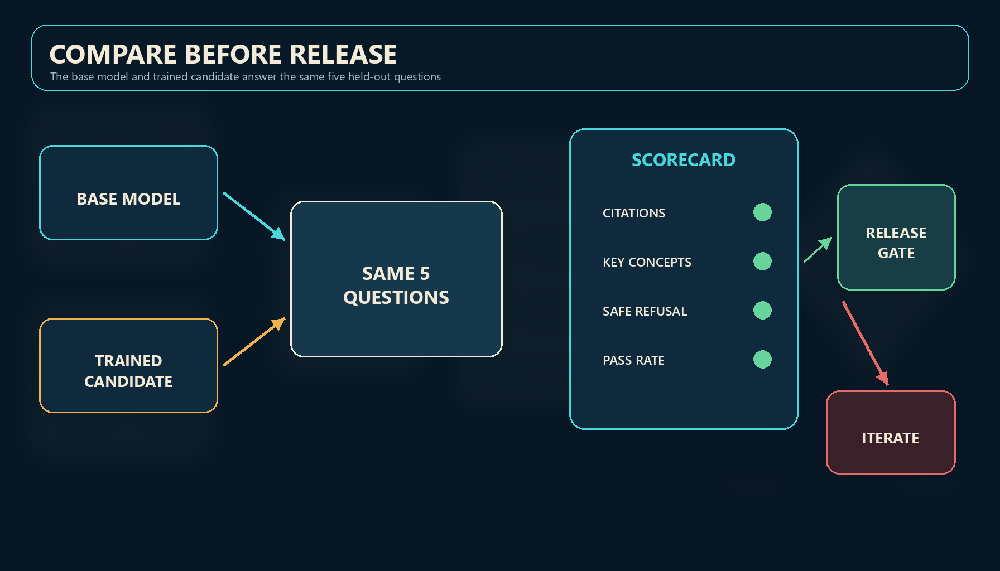

## 12. Export GGUF and hash every artifact

Export from the saved merged model. The exporter binds the GGUF and mmproj hashes to that merged-model directory and the exact training manifest:

```powershell
.venv\Scripts\python.exe finetune/export_gguf.py `
  --model-path finetune/outputs/qwen35_4b_approved_v1/merged_model `
  --output-dir finetune/outputs/qwen35_4b_approved_v1 `
  --run-manifest finetune/outputs/qwen35_4b_approved_v1/run_manifest.json `
  --gguf-name qwen3_5_4b_private_analyst_v1
```

The exporter writes `SHA256SUMS` beside the GGUF outputs. Qwen3.5 deployment requires both the Q4_K_M model and its matching bf16 mmproj companion.

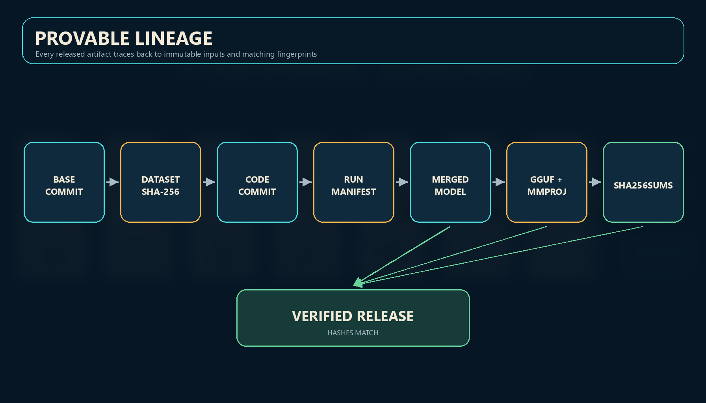

Copy the two GGUF files and checksum file to `deployment/models/`. Bootstrap recalculates both hashes and refuses stale or corrupted files.

## 13. Enforce release gates

Run the gate after candidate evaluation and GGUF export:

```powershell
.venv\Scripts\python.exe finetune/validate_release.py `
  --run-dir finetune/outputs/qwen35_4b_approved_v1 `
  --benchmark-json deployment/benchmarks/candidate.json
```

The command requires:

- every eligible approved row, with no sample truncation;
- disjoint train and evaluation documents;
- assistant-only loss and bf16 LoRA;
- an immutable base model revision loaded by commit;
- committed training code with a clean worktree;
- train loss below `1.2`;
- final evaluation loss below baseline evaluation loss;
- at least four of five benchmark cases passing;
- a safe unsupported-question fallback;
- merged model, model GGUF, and mmproj files;
- SHA-256 verification.

On success it writes `release_manifest.json`, `SHA256SUMS`, a model card, a metadata-only dataset card, `run_summary.json`, and `benchmark_summary.json`. Raw benchmark answers and the local manifest's paths and document IDs remain local.

## 14. Publish privately and verify the Hub

Never put a token in a command, notebook, file, or log. Set `HF_TOKEN` in the user environment. Upload the validated run directory:

```powershell
.venv\Scripts\python.exe finetune/push_to_huggingface.py `
  --run-dir finetune/outputs/qwen35_4b_approved_v1 `
  --release-manifest finetune/outputs/qwen35_4b_approved_v1/release_manifest.json `
  --repo-id YOUR_ACCOUNT/private-analyst-qwen35-v1 `
  --dataset-card finetune/outputs/qwen35_4b_approved_v1/dataset_card.md `
  --dataset-repo-id YOUR_ACCOUNT/private-analyst-reviewed-sft-metadata
```

The helper verifies private visibility before upload, rejects unlisted remote files, uploads only the hashed inventory, and verifies remote SHA-256 bytes. The dataset repository contains metadata only, never corpus text, examples, raw benchmark answers, paths, or document IDs.

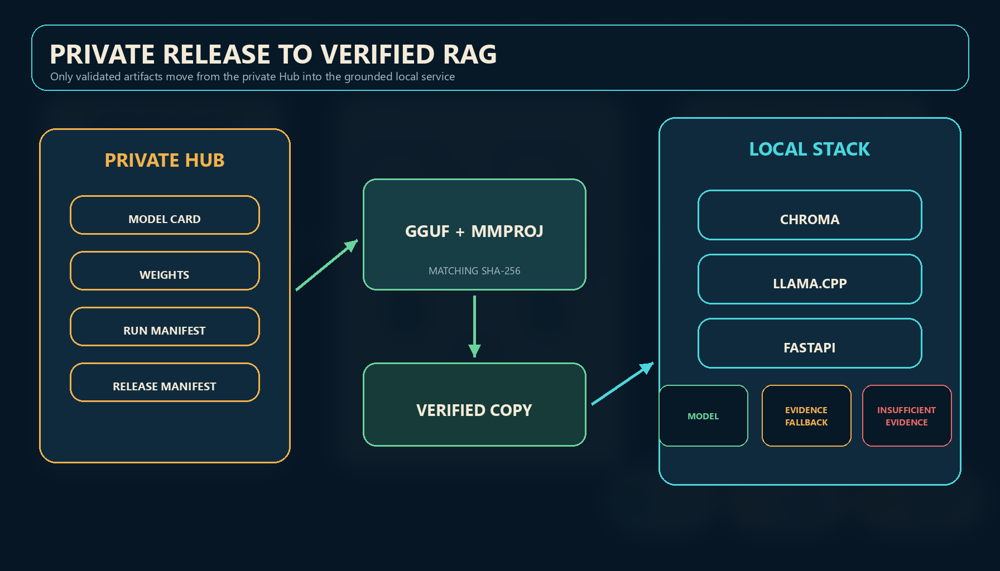

## 15. Start the verified local stack

Create `deployment/.env` from `.env.example`, set a real Chroma token, and ensure the three deployment files exist:

- the Q4_K_M GGUF;
- the matching bf16 mmproj GGUF;
- `SHA256SUMS` with entries for both filenames.

Then run:

```powershell
.venv\Scripts\python.exe deployment/bootstrap_local.py --ingest-limit 1024
```

`/healthz` reports `ok` only when inference responds and a real embedding query succeeds against a non-empty Chroma collection. Query:

```powershell
curl.exe -X POST http://localhost:8000/query `
  -H "Content-Type: application/json" `
  -d '{"query":"What are the key margin risks for ACB?"}'
```

The response includes `answer_mode`:

- `model`: cited model answer;
- `evidence_fallback`: safe excerpts because model output failed grounding;
- `insufficient_evidence`: no usable evidence or an explicit model refusal because the retrieved context is insufficient.

## 16. Reading a failed gate

A failed release is useful evidence:

- **approved_data_only:** finish human review;
- **full_approved_dataset:** remove a truncating `--max-samples` cap;
- **committed_training_code:** commit the intended code, then train from a clean worktree;
- **document_split:** repair missing or reused `doc_id` metadata;
- **assistant_only_loss:** fix the model chat template or Unsloth version;
- **eval_improvement:** revise data or hyperparameters; do not release;
- **benchmark:** inspect per-question modes, citations, and expected concepts;
- **fallback_safety:** restore the refusal path before any deployment;
- **gguf_bundle:** export or copy the matching mmproj;
- **checksum mismatch:** recopy artifacts; never update a hash to hide unexplained drift.

## 17. Interactive practice

Open [`notebooks/private_analyst_fine_tuning_tutorial.ipynb`](../notebooks/private_analyst_fine_tuning_tutorial.ipynb). Its default cells use synthetic text and standard-library checks. Private corpus inspection, GPU training, Hub upload, and deployment are disabled until you explicitly change their opt-in flags.

## Completion checklist

- [ ] I can explain why RAG owns facts and fine-tuning owns behavior.
- [ ] Every training row is human-reviewed and marked `approved`.
- [ ] Every row has `metadata.doc_id`.
- [ ] Train and evaluation documents are disjoint.
- [ ] The run used bf16 LoRA and assistant-only loss.
- [ ] `run_manifest.json` names an immutable base revision and dataset hash.
- [ ] Candidate evaluation did not regress from baseline.
- [ ] At least four of five benchmark cases pass and refusal is safe.
- [ ] GGUF and mmproj hashes verify.
- [ ] `validate_release.py` passes.
- [ ] Hugging Face model and metadata-only dataset repositories are private.
- [ ] Local bootstrap reports both collection and inference available.
